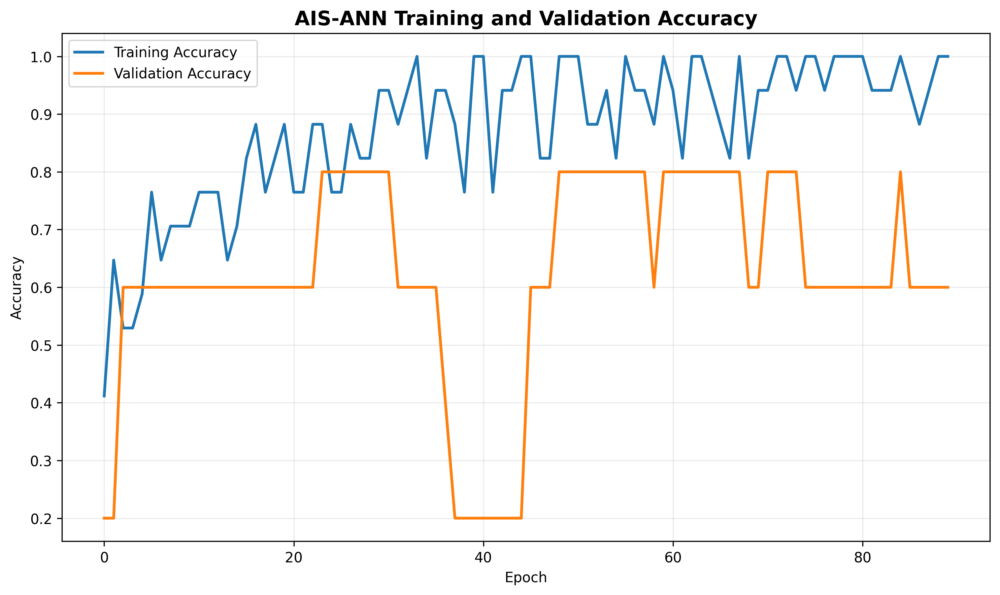

# State-Level Family Planning Unmet Need Pattern Analysis and Classification

## Overview

Family planning is an important component of public health and sustainable development. Understanding differences in unmet family planning needs across regions can help identify demographic patterns and support data-driven analysis.

This project presents a **Machine Learning and Artificial Intelligence-based framework for State-Level Family Planning Unmet Need Pattern Analysis and Classification** using data from **NFHS-3 (National Family Health Survey 2005–06)**.

The project analyzes state-level family planning indicators and classifies unmet family planning need into three categories:

- **Low**
- **Moderate**
- **High**

Multiple Machine Learning and Deep Learning algorithms are evaluated for classification. In addition, **Artificial Immune System (AIS)** and **Particle Swarm Optimization (PSO)** techniques are implemented for intelligent feature selection and optimization.

The complete workflow includes:

- Data preprocessing
- Missing-value handling
- Exploratory analysis
- Target generation
- Feature scaling
- Machine Learning classification
- Artificial Neural Network classification
- Artificial Immune System feature selection
- Particle Swarm Optimization feature selection
- Model comparison
- Prediction generation
- Performance visualization
- Model serialization

---

# Project Objectives

The major objectives of this project are:

1. Analyze state-level patterns in unmet family planning needs.
2. Study relationships among different family planning indicators.
3. Classify states/regions according to their level of unmet need.
4. Compare multiple Machine Learning algorithms.
5. Develop an Artificial Neural Network for classification.
6. Apply Artificial Immune System optimization for feature selection.
7. Apply Particle Swarm Optimization for feature selection.
8. Compare the performance of optimized and conventional models.
9. Generate interpretable visualizations of model performance.
10. Save trained models and preprocessing components for future prediction.

---

# Dataset

The project uses the dataset:

```text
unmetneedforFPNFHS3.csv
```

The dataset contains state/UT-level statistics related to **unmet need for family planning in India based on NFHS-3 (2005–06)**.

The data contains indicators associated with unmet family planning needs across different population groups.

Typical indicators include:

- Total unmet need
- Rural unmet need
- Urban unmet need
- Unmet need for spacing
- Unmet need for limiting
- Rural and urban family planning indicators
- State/UT information

---

# Problem Statement

Different states and regions may exhibit substantially different patterns of unmet family planning needs.

The objective of this project is to develop an AI-based classification framework capable of analyzing these indicators and assigning observations to an unmet-need category.

The classification problem is defined as:

```text
Input:
State-level family planning indicators

        ↓

Data Preprocessing

        ↓

Feature Selection / Optimization

        ↓

Machine Learning / Deep Learning Model

        ↓

Predicted Unmet Need Category

        ↓

Low / Moderate / High
```

---

# Target Variable

The project creates a classification target named:

```text
Unmet_Need_Category
```

The numerical unmet-need indicator is divided into three groups using quantile-based thresholds.

The resulting classes are:

| Category | Description |
|---|---|
| Low | Relatively lower unmet family planning need |
| Moderate | Intermediate unmet family planning need |
| High | Relatively higher unmet family planning need |

Using data-driven thresholds allows the categories to adapt to the distribution of the available dataset.

---

# Important Target Leakage Prevention

The numeric variable used to generate `Unmet_Need_Category` is deliberately **removed from the predictor variables**.

For example, if total unmet need is used to determine whether a record belongs to Low, Moderate, or High, that same total unmet-need value is not provided directly to the classifier.

This is necessary because otherwise the model would effectively receive the information used to construct its target, producing misleadingly high performance through **target leakage**.

---

# Project Workflow

The overall workflow is:

```text
Dataset
   |
   v
Data Cleaning
   |
   v
Numeric Conversion
   |
   v
Missing Value Handling
   |
   v
Target Generation
   |
   v
Feature Scaling
   |
   +-------------------------------+
   |                               |
   v                               v
Baseline ML                    Optimization
Models                         Algorithms
                                   |
                         +---------+---------+
                         |                   |
                         v                   v
                        AIS                 PSO
                         |                   |
                         v                   v
                    Feature Selection   Feature Selection
                         |                   |
                         +---------+---------+
                                   |
                                   v
                           Classification
                                   |
                                   v
                         Performance Evaluation
                                   |
                                   v
                       Results & Visualizations
```

---

# Data Preprocessing

The preprocessing pipeline performs several operations automatically.

## Column Cleaning

Column names are cleaned by:

- Removing leading/trailing spaces
- Removing newline characters
- Removing repeated whitespace
- Standardizing column formatting

## Numeric Conversion

Columns containing numeric values represented as strings are automatically converted into numerical format.

Characters such as:

```text
,
%
```

are removed where necessary before conversion.

## Missing Value Handling

Missing numerical values are handled using:

```text
Median Imputation
```

Median imputation was selected because it is less sensitive to extreme values than mean imputation.

## Feature Scaling

Numerical features are standardized using:

```python
StandardScaler
```

Standardization transforms the features approximately according to:

```text
z = (x - mean) / standard deviation
```

This is particularly important for algorithms such as:

- Logistic Regression
- KNN
- SVM
- Artificial Neural Networks

---

# Machine Learning Models

The project compares several classification algorithms.

## Logistic Regression

Logistic Regression provides a simple statistical baseline for the multiclass classification task.

## Decision Tree

Decision Trees recursively divide the feature space according to conditions that improve class separation.

## Random Forest

Random Forest combines multiple decision trees and aggregates their predictions.

It can provide strong performance for structured/tabular datasets and is also used as a fitness evaluator during feature optimization.

## K-Nearest Neighbors

KNN predicts a category according to the classes of nearby observations in the transformed feature space.

## Support Vector Machine

Support Vector Machine attempts to construct decision boundaries that separate the different unmet-need categories.

An RBF kernel is used to model nonlinear relationships.

## Gradient Boosting

Gradient Boosting sequentially builds weak learners, with subsequent models focusing on errors made by previous learners.

## Artificial Neural Network

A feed-forward Artificial Neural Network is also implemented.

The general network architecture is:

```text
Input Layer
     |
     v
Dense Layer - 64 Neurons - ReLU
     |
     v
Batch Normalization
     |
     v
Dropout
     |
     v
Dense Layer - 32 Neurons - ReLU
     |
     v
Dropout
     |
     v
Dense Layer - 16 Neurons - ReLU
     |
     v
Softmax Output Layer
```

The output layer produces probabilities for:

```text
Low
Moderate
High
```

The ANN uses:

```text
Optimizer: Adam
Loss: Sparse Categorical Crossentropy
Output Activation: Softmax
```

Early stopping is implemented to reduce unnecessary training and restore the best model weights.

---

# Artificial Immune System (AIS)

One of the major optimization components of this project is the **Artificial Immune System**.

AIS is a nature-inspired computational approach based on mechanisms observed in biological immune systems.

This project uses a **Clonal Selection-inspired AIS algorithm for feature selection**.

---

## AIS Feature Representation

Each candidate solution is represented as an antibody.

For example:

```text
Feature 1  Feature 2  Feature 3  Feature 4  Feature 5
    1          0          1          1          0
```

Here:

```text
1 = Feature selected
0 = Feature rejected
```

Therefore, the antibody represents a possible subset of the original predictor variables.

---

## AIS Fitness Function

Each antibody is evaluated using a Machine Learning classifier.

Random Forest with cross-validation is used to estimate the quality of a feature subset.

Conceptually, the fitness function is:

```text
Fitness =
Cross-Validated Classification Accuracy
-
Feature Selection Penalty
```

The feature penalty discourages the optimization algorithm from selecting every available feature unnecessarily.

The optimization therefore attempts to balance:

```text
High Predictive Performance
            +
Smaller Feature Subset
```

---

# AIS Clonal Selection Process

The AIS optimization process follows these major steps:

```text
Generate Initial Antibody Population
                |
                v
Calculate Fitness
                |
                v
Select High-Fitness Antibodies
                |
                v
Clone Elite Antibodies
                |
                v
Apply Mutation
                |
                v
Evaluate New Antibodies
                |
                v
Retain Strong Solutions
                |
                v
Introduce New Random Antibodies
                |
                v
Repeat for Multiple Generations
                |
                v
Select Best Feature Subset
```

High-quality antibodies are retained while mutated clones explore alternative feature combinations.

Random antibodies are also introduced to preserve diversity in the search population.

---

# AIS Model Accuracy Visualization

The following graph shows the **training and validation accuracy of the ANN trained using AIS-selected features**.



The graph can be used to observe:

- Training accuracy progression
- Validation accuracy progression
- Model convergence
- Possible overfitting
- Stability across training epochs

A small gap between training and validation accuracy generally indicates better generalization, although the small size of this dataset means the validation curve should be interpreted cautiously.

---

# Particle Swarm Optimization (PSO)

The project also implements **Particle Swarm Optimization** for feature selection.

PSO is a population-based optimization technique inspired by collective behaviors such as bird flocking and fish schooling.

Each candidate solution is represented as a particle.

---

# Binary PSO Feature Representation

For feature selection, a particle contains binary values.

Example:

```text
[1, 0, 1, 1, 0, 1]
```

This represents:

```text
Feature 1 -> Selected
Feature 2 -> Rejected
Feature 3 -> Selected
Feature 4 -> Selected
Feature 5 -> Rejected
Feature 6 -> Selected
```

---

# PSO Optimization Process

Each particle maintains information about:

- Current position
- Current velocity
- Personal best position
- Global best position

The velocity is influenced by:

```text
Inertia Component
       +
Cognitive Component
       +
Social Component
```

The cognitive component encourages a particle to move toward its own best previous solution.

The social component encourages it to move toward the best solution discovered by the swarm.

Since feature selection is binary, a sigmoid transfer function converts particle velocity into feature-selection probabilities.

---

# Model Evaluation

Model performance is primarily evaluated using:

```text
Accuracy
```

Additional evaluation information includes:

- Confusion matrix
- Precision
- Recall
- F1-score
- Classification report
- Prediction confidence
- Per-class probability

The project also generates model comparison results to compare conventional and optimized classification pipelines.

---

# Generated Visualizations

The project produces several visualization files.

## Baseline Visualizations

```text
accuracy_graph.png
heatmap.png
comparison_graph.png
result_graph.png
prediction_graph.png
```

## AIS Visualizations

```text
ais_accuracy_graph.png
ais_heatmap.png
ais_comparison_graph.png
ais_result_graph.png
ais_prediction_graph.png
ais_feature_selection_graph.png
ais_fitness_graph.png
```

## PSO Visualizations

```text
pso_accuracy_graph.png
pso_heatmap.png
pso_comparison_graph.png
pso_result_graph.png
pso_prediction_graph.png
pso_feature_selection_graph.png
pso_fitness_graph.png
```

---

# Correlation Heatmap

Correlation analysis is used to examine relationships between numerical family planning indicators.

The heatmap helps identify:

- Positively correlated indicators
- Negatively correlated indicators
- Strong relationships
- Weak relationships
- Potentially redundant features

AIS and PSO versions of the heatmap can focus specifically on the features retained by the corresponding optimization method.

---

# Model Comparison

The comparison stage evaluates models such as:

```text
Logistic Regression
Decision Tree
Random Forest
KNN
SVM
Gradient Boosting
Artificial Neural Network
```

The comparison graph provides a visual representation of the test accuracy achieved by each model under the selected feature set.

---

# Result CSV

Model performance is stored in result files such as:

```text
result.csv
ais_result.csv
pso_result.csv
```

Typical information includes:

```text
Rank
Model
Accuracy
Accuracy Percentage
Number of Selected Features
Optimization Fitness
```

These files make it easier to compare experiments programmatically.

---

# Prediction CSV

Detailed test-set predictions are stored in files such as:

```text
prediction.csv
ais_prediction.csv
pso_prediction.csv
```

Depending on the experiment, the prediction files contain information such as:

```text
State / Region
Actual Unmet Need Value
Actual Category
Predicted Category
Correct Prediction
Prediction Confidence
Probability of Low
Probability of Moderate
Probability of High
```

This allows individual model decisions to be inspected rather than relying only on aggregate accuracy.

---

# Saved Model Files

The trained ANN is stored in HDF5 format.

Baseline:

```text
family_planning_model.h5
```

AIS:

```text
ais_family_planning_model.h5
```

PSO:

```text
pso_family_planning_model.h5
```

The models can later be loaded using TensorFlow/Keras.

Example:

```python
import tensorflow as tf

model = tf.keras.models.load_model(
    "ais_family_planning_model.h5"
)
```

---

# Preprocessing Files

Preprocessing components are serialized using Pickle.

Examples:

```text
family_planning_preprocessor.pkl
ais_family_planning_preprocessor.pkl
pso_family_planning_preprocessor.pkl
```

Depending on the experiment, these files preserve information such as:

- Selected features
- Rejected features
- Imputer
- StandardScaler
- LabelEncoder
- Class names
- Target thresholds
- AIS/PSO optimization information

Saving preprocessing objects is important because future data must undergo the **same transformations used during training**.

---

# YAML Configuration

Experiment configuration is saved in YAML format.

Examples:

```text
family_planning_config.yaml
ais_family_planning_config.yaml
pso_family_planning_config.yaml
```

The configuration files provide human-readable information about:

- Project configuration
- Dataset location
- Optimization parameters
- Selected features
- Model architecture
- Training configuration
- Classification thresholds
- Model performance

---

# JSON Metadata

Detailed experiment metadata is also stored in JSON format.

Examples:

```text
family_planning_metadata.json
ais_family_planning_metadata.json
pso_family_planning_metadata.json
```

These files can contain:

- Dataset information
- Feature information
- Optimization parameters
- Selected features
- Accuracy
- Confusion matrix
- Classification report
- Best model information

---

# Project Structure

A typical project directory may look like:

```text
State-Level Family Planning Unmet Need Pattern Analysis and Classification/
│
├── unmetneedforFPNFHS3.csv
│
├── README.md
│
├── family_planning_model.h5
├── family_planning_preprocessor.pkl
├── family_planning_config.yaml
├── family_planning_metadata.json
│
├── accuracy_graph.png
├── heatmap.png
├── comparison_graph.png
├── result.csv
├── result_graph.png
├── prediction.csv
├── prediction_graph.png
│
├── ais_family_planning_model.h5
├── ais_family_planning_preprocessor.pkl
├── ais_family_planning_config.yaml
├── ais_family_planning_metadata.json
│
├── ais_feature_selection.csv
├── ais_feature_selection_graph.png
├── ais_fitness_graph.png
├── ais_accuracy_graph.png
├── ais_heatmap.png
├── ais_comparison_graph.png
├── ais_result.csv
├── ais_result_graph.png
├── ais_prediction.csv
├── ais_prediction_graph.png
│
├── pso_family_planning_model.h5
├── pso_family_planning_preprocessor.pkl
├── pso_family_planning_config.yaml
├── pso_family_planning_metadata.json
│
├── pso_feature_selection.csv
├── pso_feature_selection_graph.png
├── pso_fitness_graph.png
├── pso_accuracy_graph.png
├── pso_heatmap.png
├── pso_comparison_graph.png
├── pso_result.csv
├── pso_result_graph.png
└── pso_prediction.csv
```

---

# Technologies Used

## Programming Language

```text
Python
```

## Data Processing

```text
Pandas
NumPy
```

## Machine Learning

```text
Scikit-learn
```

## Deep Learning

```text
TensorFlow
Keras
```

## Visualization

```text
Matplotlib
```

## Optimization

```text
Artificial Immune System (AIS)
Clonal Selection Algorithm
Particle Swarm Optimization (PSO)
Binary PSO
```

## Model and Configuration Storage

```text
HDF5
Pickle
YAML
JSON
CSV
```

---

# Installation

Install the required Python libraries using:

```bash
pip install numpy pandas matplotlib scikit-learn tensorflow pyyaml
```

For Jupyter Notebook:

```python
!pip install numpy pandas matplotlib scikit-learn tensorflow pyyaml
```

---

# Running the Project

Clone or download the repository.

Place the dataset in the project directory:

```text
unmetneedforFPNFHS3.csv
```

Update the dataset/project path in the Python code if necessary.

Example:

```python
PROJECT_DIR = (
    r"C:\Users\sagni\Downloads"
    r"\State-Level Family Planning Unmet Need Pattern Analysis and Classification"
)
```

Then execute the baseline, AIS, or PSO implementation.

The scripts automatically:

```text
Load Dataset
      ↓
Clean Data
      ↓
Create Target
      ↓
Preprocess Features
      ↓
Run Feature Selection
      ↓
Train Models
      ↓
Evaluate Models
      ↓
Generate Predictions
      ↓
Save Graphs
      ↓
Save CSV Results
      ↓
Save H5 / PKL / YAML / JSON
```

---

# Loading the Saved Model

The trained AIS ANN can be loaded using:

```python
import tensorflow as tf

model = tf.keras.models.load_model(
    "ais_family_planning_model.h5"
)

model.summary()
```

---

# Loading the Preprocessor

```python
import pickle

with open(
    "ais_family_planning_preprocessor.pkl",
    "rb"
) as file:

    preprocessor = pickle.load(file)

print(
    preprocessor["selected_features"]
)
```

The stored preprocessing components should be used before making predictions on new observations.

---

# Key Features of the Project

- State-level family planning analysis
- Automated data preprocessing
- Low/Moderate/High classification
- Multiple Machine Learning classifiers
- Artificial Neural Network
- Artificial Immune System optimization
- Clonal Selection-based feature selection
- Particle Swarm Optimization
- Binary PSO feature selection
- Cross-validation-based optimization
- Feature subset penalty
- Correlation analysis
- Model comparison
- Actual vs predicted visualization
- Prediction confidence
- CSV result generation
- H5 model persistence
- PKL preprocessing persistence
- YAML configuration export
- JSON metadata export

---

# Why Use AIS?

Artificial Immune Systems provide a population-based optimization mechanism inspired by immune-system adaptation.

In this project, AIS provides a systematic approach for searching through possible feature combinations instead of relying solely on manually selected variables.

Potential benefits include:

- Automated feature selection
- Removal of less useful variables
- Exploration of different feature subsets
- Reduction of model input dimensionality
- Integration of predictive performance into feature selection

---

# Why Use PSO?

Particle Swarm Optimization provides another population-based approach to searching the feature-selection space.

Its main advantages in this project include:

- Simple optimization mechanism
- Personal and global search memory
- Efficient exploration of binary feature combinations
- Automatic feature subset optimization
- Ability to balance predictive accuracy and feature reduction

Using both AIS and PSO also enables comparison between two different nature-inspired optimization strategies.

---

# Limitations

The dataset used in this project is relatively small and contains state/UT-level aggregated observations.

Therefore, model performance must be interpreted carefully.

A small test set means that even one additional correct or incorrect prediction can cause a substantial change in reported test accuracy.

The project should consequently be considered primarily a demonstration of:

- Data analysis
- Classification
- Feature selection
- Nature-inspired optimization
- Machine Learning model comparison

rather than evidence of a production-ready public-health prediction system.

Additionally, the data originates from **NFHS-3 (2005–06)**, so the model should not be interpreted as representing current family planning conditions in India.

---

# Future Scope

The project can be extended by:

1. Incorporating newer NFHS datasets such as NFHS-4 and NFHS-5.
2. Comparing unmet need across multiple survey periods.
3. Adding socioeconomic and demographic indicators.
4. Performing district-level analysis.
5. Developing temporal forecasting models.
6. Adding geographic visualization.
7. Integrating explainable AI methods such as SHAP.
8. Applying additional evolutionary optimization algorithms.
9. Performing nested cross-validation for more robust model assessment.
10. Developing an interactive analytical dashboard.
11. Building a web-based prediction interface.
12. Comparing AIS and PSO against genetic algorithms and other metaheuristics.

---

# Conclusion

This project demonstrates an end-to-end **AI-based framework for State-Level Family Planning Unmet Need Pattern Analysis and Classification**.

The framework combines conventional Machine Learning, Artificial Neural Networks, and nature-inspired optimization techniques to investigate family planning indicators and classify unmet need into **Low, Moderate, and High** categories.

The implementation of **Artificial Immune System-based feature selection** introduces a Clonal Selection-inspired search strategy for identifying informative feature subsets, while **Particle Swarm Optimization** provides an alternative swarm-intelligence approach.

The project also emphasizes reproducibility by saving trained models, preprocessing objects, configuration files, metadata, predictions, performance results, and visualizations.

Overall, the project demonstrates how **data preprocessing, Machine Learning, Deep Learning, AIS, and PSO** can be integrated into a single analytical pipeline for structured public-health data.

---

# Disclaimer

This project is intended for **educational, academic, and research purposes**.

The generated classifications and predictions should not be interpreted as medical advice, public-health recommendations, or current assessments of individual states or populations.

The underlying data represents historical survey information, and model results depend on the size, quality, and characteristics of the available dataset.

---

# License

This project is intended for educational and research use.

If the dataset is redistributed, its original source and applicable terms should be reviewed and appropriately acknowledged.

---

# Author

Developed as a Machine Learning and Artificial Intelligence project focused on:

- Data Analytics
- Machine Learning
- Deep Learning
- Artificial Immune Systems
- Particle Swarm Optimization
- Feature Selection
- Classification
- Public Health Data Analysis
